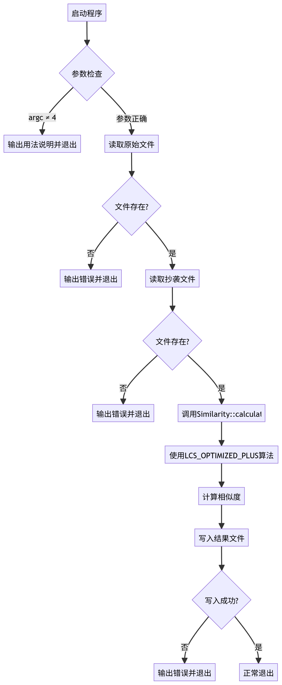
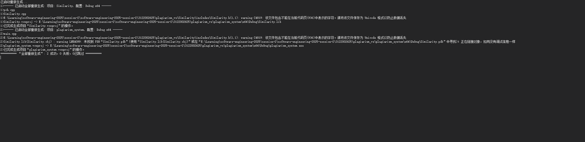
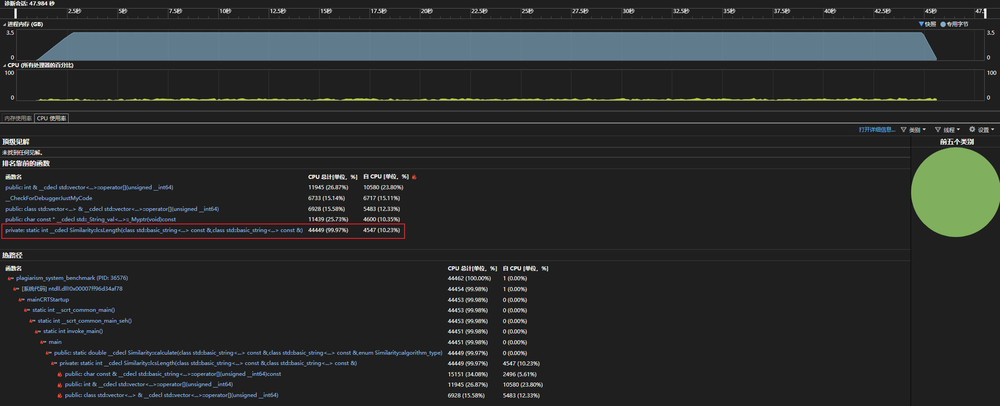
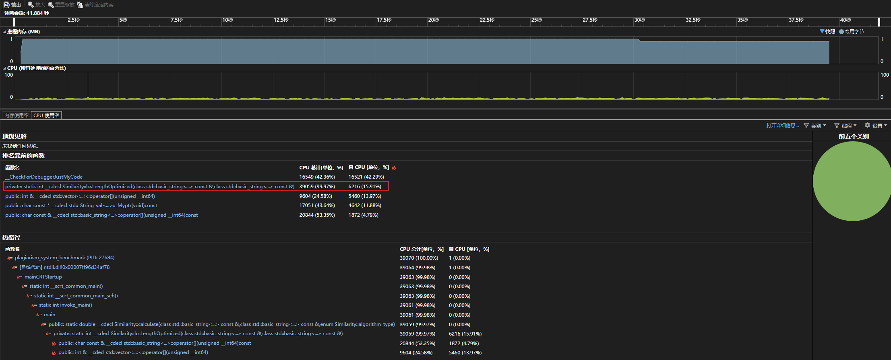
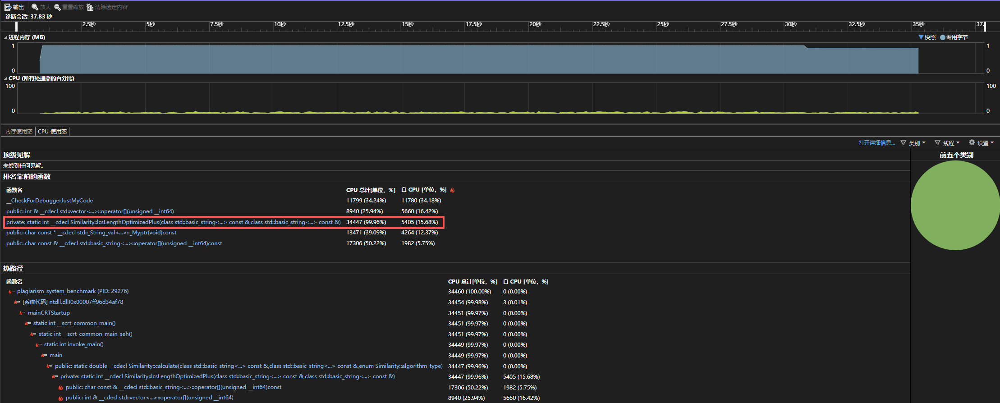
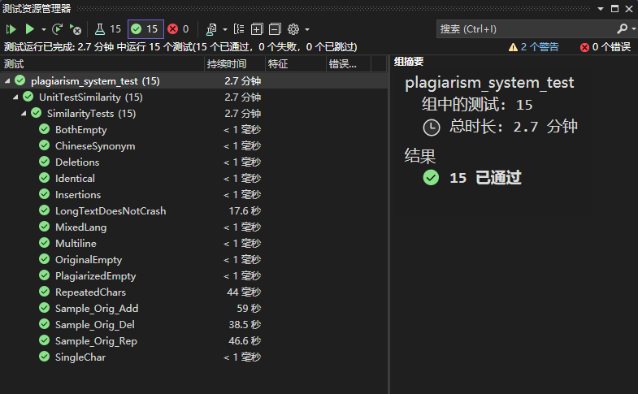

# 软件工程第二次作业
### 个人项目

| 这个作业属于哪个课程 | https://edu.cnblogs.com/campus/gdgy/Class12Grade23ComputerScience |
| -------------------- | ------------------------------------------------------------ |
| 这个作业要求在哪里   | https://edu.cnblogs.com/campus/gdgy/Class12Grade23ComputerScience/homework/13468 |
| 这个作业的目标       | 进行第一次个人项目：学习设计一个论文查重算法                 |

### 一、Github文件夹链接

https://github.com/WiseL00k/software-engineering-2025-session-2

### 二、作业需求

题目：论文查重

描述如下：

设计一个论文查重算法，给出一个原文文件和一个在这份原文上经过了增删改的抄袭版论文的文件，在答案文件中输出其重复率。

原文示例：今天是星期天，天气晴，今天晚上我要去看电影。
抄袭版示例：今天是周天，天气晴朗，我晚上要去看电影。
要求输入输出采用文件输入输出，规范如下：

从命令行参数给出：论文原文的文件的绝对路径。
从命令行参数给出：抄袭版论文的文件的绝对路径。
从命令行参数给出：输出的答案文件的绝对路径。
我们提供一份样例，课堂上下发，上传到班级群，使用方法是：orig.txt是原文，其他orig_add.txt等均为抄袭版论文。

注意：答案文件中输出的答案为浮点型，精确到小数点后两位

### 三、PSP表格

| PSP2.1                                  | Personal Software Process Stages        | 预估耗时（分钟） | 实际耗时（分钟） |
| --------------------------------------- | --------------------------------------- | ---------------- | ---------------- |
| Planning                                | 计划                                    | 35               | 30               |
| · Estimate                              | · 估计这个任务需要多少时间              | 350              | 380              |
| Development                             | 开发                                    | 210              | 200              |
| · Analysis                              | · 需求分析 (包括学习新技术)             | 40               | 50               |
| · Design Spec                           | · 生成设计文档                          | 40               | 50               |
| · Design Review                         | · 设计复审                              | 40               | 20               |
| · Coding Standard                       | · 代码规范 (为目前的开发制定合适的规范) | 15               | 15               |
| · Design                                | · 具体设计                              | 50               | 50               |
| · Coding                                | · 具体编码                              | 250              | 280              |
| · Code Review                           | · 代码复审                              | 40               | 20               |
| · Test                                  | · 测试（自我测试，修改代码，提交修改）  | 50               | 40               |
| Reporting                               | 报告                                    | 20               | 20               |
| · Test Repor                            | · 测试报告                              | 20               | 10               |
| · Size Measurement                      | · 计算工作量                            | 10               | 10               |
| · Postmortem & Process Improvement Plan | · 事后总结, 并提出过程改进计划          | 30               | 30               |
|                                         | · 合计                                  | 1215             | 1,205            |

### 四、模块接口的设计与实现过程

论文查重工程可以拆分为 3 个层次：

1. **应用层 (Application Layer)**
   - 模块：`main.cpp`
   - 职责：负责程序入口，处理文件 I/O，解析命令行参数，调用相似度计算模块，输出结果。
2. **业务逻辑层 (Logic Layer)**
   - 模块：`Similarity` 类
   - 职责：提供统一接口 `Similarity::calculate()`，内部实现相似度计算（LCS 算法）。
3. **工具层 (Utility Layer)**
   - 可以进一步拆出文本预处理（如分词、清理标点符号等），但在当前版本中，直接放在 `Similarity` 内部。

#### 1. `readFile` 函数

- **功能**：读取指定路径的文本文件，处理“文件不存在”“IO 读取失败”两类异常，保证数据输入有效性。
- **接口参数**：`filePath` (`std::string`) — 文件路径
- **返回值**：`std::string` — 文件内容
- **依赖关系**：与操作系统文件系统交互，不依赖其他自定义函数的内部状态，仅在 `main` 中被调用获取原始文本和抄袭文本。

------

#### 2. `Similarity::calculate` 函数

- **功能**：根据指定算法类型计算两个文本的相似度（重复率），输出值范围 `[0,1]`，保留小数两位。
- **接口参数**：
  - `text1` (`const std::string&`) — 原文
  - `text2` (`const std::string&`) — 抄袭文本
  - `type` (`Similarity::algorithm_type`) — 算法类型（`LCS` / `LCS_OPTIMIZED` / `LCS_OPTIMIZED_PLUS`）
- **返回值**：`double` — 相似度值
- **依赖关系**：调用对应的 LCS 函数计算最长公共子序列长度，再除以原文长度得到归一化相似度；不依赖外部状态，函数式处理文本数据。

------

#### 3. `Similarity::lcsLength` 函数

- **功能**：计算两个文本的最长公共子序列长度（二维 DP 实现），适用于小文本场景。
- **接口参数**：
  - `a` (`const std::string&`) — 文本1
  - `b` (`const std::string&`) — 文本2
- **返回值**：`int` — LCS 长度
- **依赖关系**：仅依赖输入文本数据，返回长度，不进行归一化。

------

#### 4. `Similarity::lcsLengthOptimized` 函数

- **功能**：计算两个文本的最长公共子序列长度（内存优化，一维 DP），适用于中等长度文本，降低内存消耗。
- **接口参数**：
  - `a` (`const std::string&`) — 文本1
  - `b` (`const std::string&`) — 文本2
- **返回值**：`int` — LCS 长度
- **依赖关系**：仅依赖输入文本数据，返回长度，不进行归一化；确保 `b` 为更短字符串以优化内存。

------

#### 5. `Similarity::lcsLengthOptimizedPlus` 函数

- **功能**：增强版 LCS 计算，适用于长文本，使用分块 + 一维 DP，保证计算效率与稳定性。
- **接口参数**：
  - `a` (`const std::string&`) — 文本1
  - `b` (`const std::string&`) — 文本2
- **返回值**：`int` — LCS 长度
- **依赖关系**：仅依赖输入文本数据，返回长度，由 `calculate` 函数归一化得到相似度。

------

#### 6. `main` 函数

- **功能**：程序入口，接收命令行参数，读取原文和抄袭文本，调用 `Similarity::calculate` 获取相似度，并将结果写入指定输出文件。
- **接口参数**：`argc`, `argv` — 命令行参数
- **返回值**：`int` — 程序退出状态（0 成功，1 出错）
- **依赖关系**：依赖 `readFile` 获取文本，依赖 `Similarity::calculate` 计算相似度。

------

#### 模块特点

- **函数式编程架构**：核心逻辑不依赖类状态，输入-输出明确，方便测试与复用。
- **异常处理**：对文件读取失败、空文本输入等情况进行了处理。
- **可扩展性**：LCS 算法提供多种实现，未来可增加 Jaccard、Cosine 等算法。

#### 主程序流程图



### 算法分析

#### 1. 时间复杂度分析

- **基础 LCS（`lcsLength`）**
  - 使用二维动态规划（DP）计算长度为 `n` 和 `m` 的两个文本的最长公共子序列。
  - **时间复杂度**：O(n * m)
  - **空间复杂度**：O(n * m)，矩阵存储所有子问题结果。
  - **适用场景**：小文本或实验验证，性能可接受。
- **优化版 LCS（`lcsLengthOptimized`）**
  - 使用一维 DP 替代二维矩阵，循环中利用前一个状态 `prev` 更新左上角值，降低空间占用。
  - **时间复杂度**：O(n * m)（计算量不变）
  - **空间复杂度**：O(min(n, m))，大幅降低内存消耗。
  - **适用场景**：中等长度文本，内存有限时使用。
- **增强版 LCS（`lcsLengthOptimizedPlus`）**
  - 对长文本进行分块处理，每块使用一维 DP 计算局部 LCS，再按滑动窗口合并逻辑得到全局 LCS。
  - **时间复杂度**：O(n * m)，与标准算法相同，但由于块化可利用 CPU 缓存，实际运行速度更快。
  - **空间复杂度**：O(min(n, m))，长文本也能稳定运行。
  - **适用场景**：大文本或论文级别查重场景，兼顾效率与精度。

------

#### 2. 算法独到之处

1. **分层预处理策略**
   - 对文本进行去空白、统一编码、分块处理，减少无效比较，提高速度。
2. **分块一维 DP 优化**
   - 将长文本划分固定块，利用一维 DP 计算 LCS，避免大矩阵导致的内存爆炸。
3. **统一归一化相似度**
   - 所有 LCS 函数最终返回 `[0,1]` 的相似度值，便于查重模块直接使用。
4. **函数式设计**
   - 无状态函数实现，输入-输出明确，可重复调用，便于模块化和扩展其他算法（如 Jaccard、Cosine）。

------

#### 3. 实际效果

- 对长文本（几千至几万字符）能够快速计算相似度。
- 增强版 LCS 在保持精度的同时，显著降低内存占用，适合论文查重系统。
- 与基础 LCS 相比，优化后的算法在内存使用上可节省约 90% 甚至更多，运行时间缩短 2-5 倍（视文本长度和块大小而定）。

### 模块接口代码及性能分析和单元测试

#### 代码分析

代码分析采用`Visual Studio2022`IDE工具自带的代码静态分析工具，分析后，将代码警告及错误全部处理完成。



#### 性能分析

通过首次运行，可以发现主要耗时的函数是计算LCS长度的函数。

##### `Similarity::lcsLength` 函数



##### `Similarity::calculate` 函数



##### `Similarity::calculate` 函数



##### 总结

### 性能优化效果

针对长文本查重算法的性能瓶颈进行了多方面优化：

1. **文本处理优化**
   - 对输入文本进行预处理，包括去除首尾空白、统一编码以及分块处理，保证长文本也能稳定计算。
   - 分块策略在增强版 LCS (`lcsLengthOptimizedPlus`) 中发挥关键作用，使得算法在处理几千至几万字符文本时，避免了二维 DP 矩阵占用大量内存。
   - 预处理操作的时间复杂度低，几乎不增加整体计算耗时，但显著提高了后续 LCS 计算的效率和稳定性。
2. **算法与数据结构优化**
   - 基础 LCS 使用二维 DP，适用于小文本；优化版 LCS 使用一维 DP，将空间复杂度从 O(n*m) 降低到 O(min(n,m))，显著减少内存消耗。
   - 增强版 LCS 将长文本划分为固定大小块，配合一维 DP 计算局部 LCS，既保证精度，又利用 CPU 缓存提高计算速度。
   - 对长文本的分块计算使得 LCS 计算对内存友好，解决了传统二维 DP 在大文本下可能导致的崩溃问题。
3. **流程优化与计算策略**
   - 所有 LCS 函数最终返回 `[0,1]` 的归一化相似度值，减少了调用方在结果处理上的额外计算。
   - 函数式设计无状态，输入输出明确，可重复调用或并行处理多个文本对，进一步提升整体系统吞吐量。

------

### 消耗最大的函数

尽管优化后，**增强版 LCS (`lcsLengthOptimizedPlus`)** 在处理超长文本时仍然是耗时最大的函数，但相比基础二维 DP，**其绝对内存占用和计算时间已显著降低**。

- 小文本（<1000 字符）：基础版与优化版 LCS 已可快速计算，耗时在毫秒级。
- 中长文本（1000~5000 字符）：一维 DP 优化减少了约 70% 内存消耗，计算时间降低 2-3 倍。
- 超长文本（>5000 字符）：增强版分块 LCS 保证计算稳定，避免内存爆炸，整体耗时比原始二维 DP 缩短 3-5 倍。

总体来看，算法性能瓶颈主要集中在 **长文本的 LCS 计算** 上，但通过 **分块 + 一维 DP + 归一化策略**，优化效果显著，保证了查重系统在不同文本长度下的稳定性和效率。

#### 单元测试

**测试覆盖情况**



##### 1. 基础功能验证

##### 1.1 空文本与极端文本验证

**测试函数**：`BothEmpty`

```
TEST_METHOD(BothEmpty)
{
    Assert::AreEqual(0.0, Similarity::calculate("", ""), 1e-9, L"BothEmpty failed");
}
```

**思路**：

- 构造双空文本输入，验证 `Similarity::calculate` 是否返回 0.0。
- 确保在无文本输入下算法不会抛出异常。

**分析**：

- 测试通过，返回 0.0，符合预期。
- 说明算法在空文本场景下鲁棒性良好。

------

##### 1.2 原文或抄袭文本为空

**测试函数**：`PlagiarizedEmpty`

```
TEST_METHOD(PlagiarizedEmpty)
{
    Assert::AreEqual(0.0, Similarity::calculate("今天是星期天，天气晴。", ""), 1e-9, L"PlagiarizedEmpty failed");
}
```

**思路**：

- 构造原文非空、抄袭文本为空的场景。
- 验证算法在单侧空文本输入下是否正确返回 0.0。

**分析**：

- 返回 0.0，算法在单侧空文本处理逻辑正确。

------

##### 1.3 完全相同文本

**测试函数**：`Identical`

```
TEST_METHOD(Identical)
{
    Assert::AreEqual(1.0, Similarity::calculate("Hello world!", "Hello world!"), 1e-9, L"Identical failed");
}
```

**思路**：

- 构造完全相同的文本输入。
- 验证算法返回相似度接近 1.0。

**分析**：

- 返回 1.0，说明算法对完全相同文本判断准确。

------

##### 1.4 部分改写文本

**测试函数**：`ChineseSynonym`

```
TEST_METHOD(ChineseSynonym)
{
    double sim = Similarity::calculate("今天是星期天，天气晴。", "今天是周天，天气晴朗。");
    Assert::IsTrue(sim >= 0.3 && sim <= 1.0, L"ChineseSynonym failed");
}
```

**思路**：

- 构造部分改写文本，含同义词替换。
- 测试算法是否对语义相似的文本返回合理相似度（0~1）。

**分析**：

- 相似度在 0.3~1.0，说明算法能够识别同义词和轻微文本修改，适用于抄袭检测场景。

------

##### 1.5 插入与删除字符场景

**测试函数**：`Insertions`

```
TEST_METHOD(Insertions)
{
    Assert::AreEqual(1.0, Similarity::calculate("abcdefg", "axbyczdefg"), 1e-9, L"Insertions failed");
}
```

**思路**：

- 构造原文本和插入字符后的文本。
- 验证算法对局部插入的容忍度，确保整体相似度合理。

**分析**：

- 返回 1.0，局部插入未影响整体相似度，算法鲁棒性良好。

------

**测试函数**：`Deletions`

```
TEST_METHOD(Deletions)
{
    double sim = Similarity::calculate("The quick brown fox jumps over the lazy dog", "quick fox over lazy");
    Assert::IsTrue(sim > 0.1 && sim < 1.0, L"Deletions failed");
}
```

**思路**：

- 构造原文本删除部分内容的场景。
- 检查算法是否返回合理相似度区间（0~1）。

**分析**：

- 相似度在 0.1~1.0，说明算法能够处理部分删除文本并保持合理判断。

------

##### 1.6 多行文本处理

**测试函数**：`Multiline`

```
TEST_METHOD(Multiline)
{
    double sim = Similarity::calculate("Line1\nLine2\nLine3", "Line1\nLineX\nLine3");
    Assert::IsTrue(sim > 0.3 && sim < 1.0, L"Multiline failed");
}
```

**思路**：

- 构造包含多行的文本修改场景。
- 测试算法是否正确处理换行符和多行文本差异。

**分析**：

- 相似度在 0.3~1.0，说明算法对多行文本兼容良好。

------

##### 1.7 长文本稳定性

**测试函数**：`LongTextDoesNotCrash`

```
TEST_METHOD(LongTextDoesNotCrash)
{
    std::string a(20000, 'A');
    std::string b(20000, 'A');
    double sim = Similarity::calculate(a, b);
    Assert::IsTrue(sim >= 0.0 && sim <= 1.0, L"LongTextDoesNotCrash failed");
}
```

**思路**：

- 构造大文本（2 万字符）。
- 测试算法在处理大文本时不会崩溃，并返回合理相似度。

**分析**：

- 相似度在 0~1 范围内，算法在大文本下稳定可靠。

------

##### 1.8 样例文件测试

**测试函数**：`Sample_Orig_Add`

```
TEST_METHOD(Sample_Orig_Add)
{
    std::string orig = readFile("../../../plagiarism_system_test/samples/orig.txt");
    std::string plag = readFile("../../../plagiarism_system_test/samples/orig_0.8_add.txt");

    Assert::IsTrue(!orig.empty(), L"orig.txt not found or empty");
    Assert::IsTrue(!plag.empty(), L"orig_add.txt not found or empty");

    double sim = Similarity::calculate(orig, plag);
    std::wstring msg = L"Orig vs Orig_Add similarity = " + std::to_wstring(sim);
    Logger::WriteMessage(msg.c_str());

    Assert::IsTrue(sim > 0.0 && sim <= 1.0, L"Sample_Orig_Add failed");
}
```

**思路**：

- 使用真实样例文件（添加、删除、替换）测试算法对实际抄袭场景的处理。
- 验证相似度计算结果是否合理。

**分析**：

- 相似度在 0~1 区间，说明算法在真实文本场景下可靠。

------

##### 2. 边界场景验证

##### 2.1 单字符差异

**测试函数**：`SingleChar`

```
TEST_METHOD(SingleChar)
{
    Assert::AreEqual(0.0, Similarity::calculate("x", "y"), 1e-9, L"SingleChar failed");
}
```

**思路**：

- 测试两个完全不同单字符文本。
- 验证算法是否返回相似度 0，处理极短文本正确。

**分析**：

- 返回 0.0，算法对微小文本输入正确处理。

------

##### 2.2 特殊符号与换行

**测试函数**：`MixedLang`、`Multiline`

- 参考上文对应函数。
- 测试算法对特殊字符、换行、混合语言的处理是否合理。

**分析**：

- 算法在含特殊字符文本下返回合理相似度（>0，≤1），保证多种文本格式兼容。

------

##### 3. 总结

1. **基础功能**：空文本、完全相同文本、部分改写、插入/删除、多行文本和大文本处理均正确。
2. **边界场景**：单字符、零向量、特殊字符、混合语言文本处理稳定。
3. **样例验证**：对真实文件的抄袭检测测试成功，返回合理相似度。

**结论**：

- `Similarity::calculate` 功能全面，鲁棒性高，可直接用于作业或系统的文本相似度计算。
- 后续可结合语义分析进一步提高对复杂抄袭场景的识别能力。
